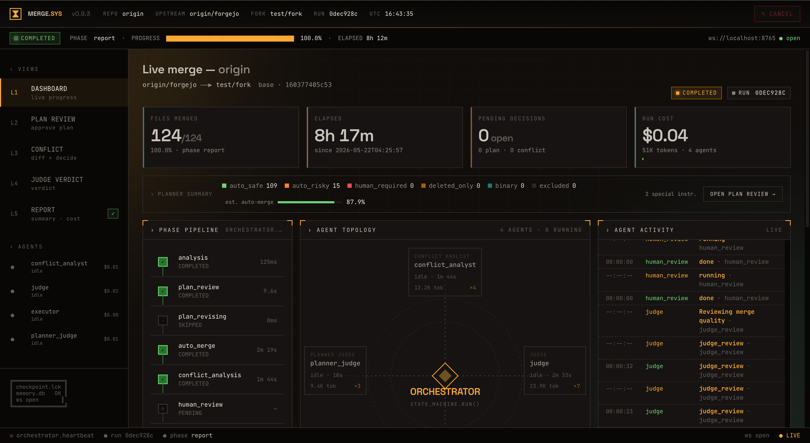
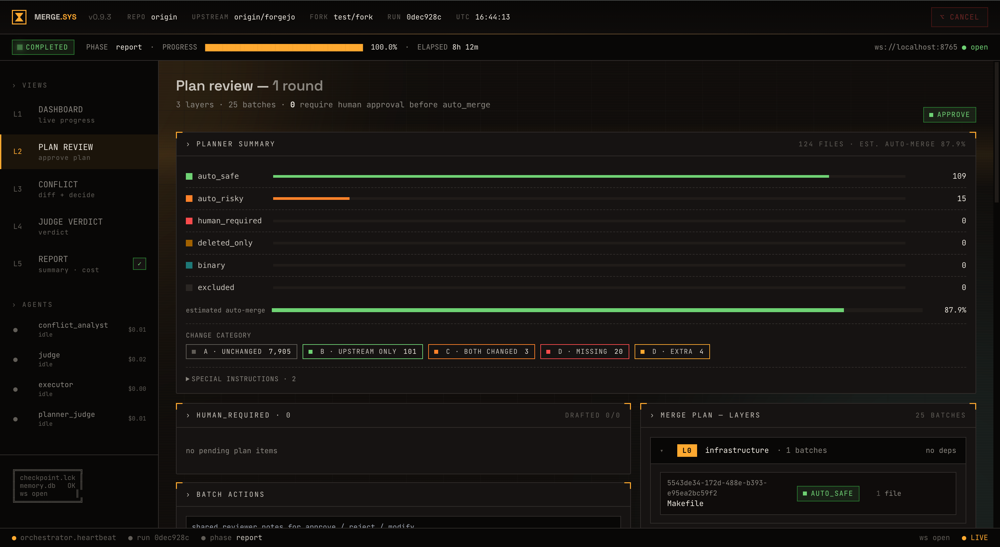
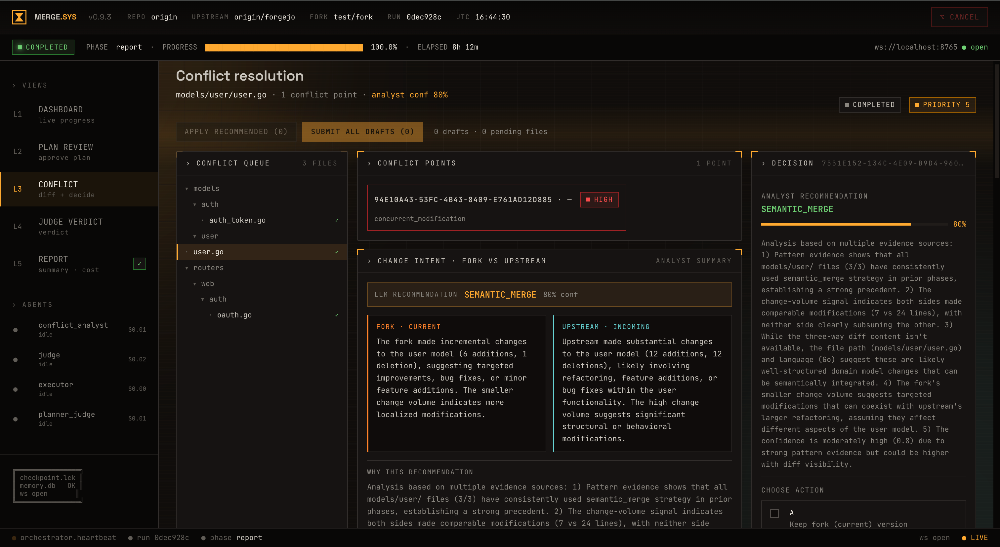
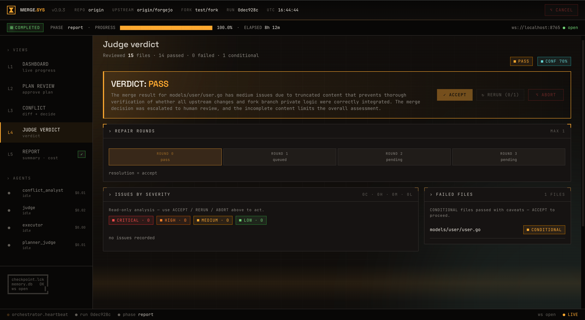
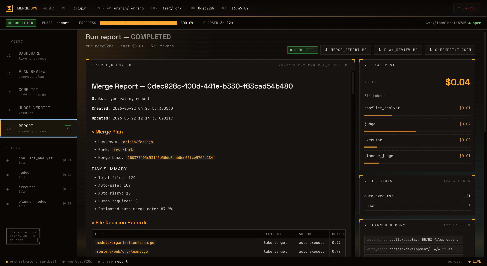

<div align="center">

**中文** | [English](README.md)

# 🔀 Code Merge System

### 把长期分叉仓库的 upstream 升级变成一条流水线——而不是 500 个文件冲突。

一个多 Agent 合并管道，把数月的 upstream 积压变成**可审计、可恢复、安全**的合并——同时保留 fork 里的每一处定制。

[](https://python.org)
[](#开发)
[](#开发)
[](#许可证)
[](https://anthropic.com)



</div>

---

## 问题在哪里

长期维护 fork 的团队在同步 upstream 时面临的现实是残酷的：

- **数百到数千个文件冲突**——根本无法逐一人工处理
- **行级 diff 掩盖了语义意图**——LLM 和人都容易判断出错
- **fork 独有的定制被静默覆盖**——API、路由、CI job、哨兵逻辑消失了，无人察觉
- **一处合并错误就可能导致运行时漏洞或功能缺失**——而且难以回滚

`git merge` 给你一份冲突列表。Code Merge System 给你一条**决策流水线**。

---

## 快速开始

```bash
pip install code-merge-system

export ANTHROPIC_API_KEY=sk-ant-...
export OPENAI_API_KEY=sk-...

cd /path/to/your-fork-repo
merge upstream/main --dry-run    # 先预览合并计划，不动任何文件
```

> 首次运行会打开浏览器并引导完成一次性配置向导。配置保存至 `.merge/config.yaml`，之后运行无需再配置。

---

## 界面一览

<table>
<tr>
<td width="50%">

**计划审查** — 124 个文件，87.9% 自动合并置信度，A–E 五类变更分布。



</td>
<td width="50%">

**冲突解决** — 并排展示 fork 与 upstream 的变更意图，LLM 给出合并策略推荐（SEMANTIC_MERGE 85% 置信度）。



</td>
</tr>
<tr>
<td width="50%">

**Judge 裁决** — 独立 Review Agent 审查每个已合并文件；按 CRITICAL/HIGH/MEDIUM/LOW 分级列出问题，支持多轮修复。



</td>
<td width="50%">

**运行报告** — 完整费用明细（124 个文件 $0.04），每个 Agent 的 token 用量，以及本次 run 写入的记忆条目。



</td>
</tr>
</table>

---

## 工作原理

八个阶段由状态机驱动。七个专门化 Agent。每次文件写入前自动快照。任意时刻 `Ctrl+C` 都安全。

```
┌─────────────────────────────────────────────────────────────┐
│  CLI / Web UI                                               │
│         │                                                   │
│   Orchestrator ── 8 阶段状态机                              │
│         │                                                   │
│  ┌──────┴───────┐                                          │
│  │              │                                           │
│ Agents        Tools              Memory                     │
│ (7 个角色)   (50+ 确定性工具      (L0/L1/L2                  │
│              + AST 解析器)        跨 run 记忆存储)           │
│  │                                                          │
│ LLM 层（Anthropic + OpenAI，凭据池，智能路由）               │
└─────────────────────────────────────────────────────────────┘
```

| 阶段 | 发生了什么 |
|------|-----------|
| `INITIALIZE` | 三方分类、风险打分、forks-profile 路由 |
| `PLANNING` | Planner 生成每文件合并策略 |
| `PLAN_REVIEW` | PlannerJudge 审查计划；最多 2 轮修订 |
| `AWAITING_HUMAN` | 你审阅计划报告；填入 `HUMAN_REQUIRED` 决策 |
| `AUTO_MERGING` | Executor 应用自动安全文件，写前快照 |
| `CONFLICT_ANALYSIS` | ConflictAnalyst 对高风险冲突做语义分析 |
| `JUDGE_REVIEW` | Judge + 50+ 确定性扫描器审查所有合并产物 |
| `COMPLETED` | 生成完整报告；你决定何时 `git commit` |

| Agent | 角色 | 默认模型 |
|-------|------|----------|
| Planner | 生成合并计划 | Claude Opus |
| PlannerJudge | 审查计划（只读） | GPT-4o |
| ConflictAnalyst | 高风险冲突语义分析 | Claude Sonnet |
| Executor | **唯一写权限**——应用合并 | GPT-4o |
| Judge | 审查合并结果 + 确定性复检 | Claude Opus |
| HumanInterface | 生成决策模板 | Claude Haiku |
| SmokeTest | 合并后冒烟测试 | — |

> **为什么用两个 LLM 提供商？** Planner/Judge 使用 Anthropic；Executor/PlannerJudge 使用 OpenAI。审查者与执行者用不同供应商，消除共谋偏差。

---

## 功能特性

### [六大丢失模式检测](doc/modules/tools.md)
Shadow 冲突、接口反向影响、顶层调用丢失、配置行保留、Scar 自学习、业务哨兵扫描——这些是 `git merge` 完全检测不到的失败模式。

### [写前快照](doc/modules/core.md)
每次文件写入前自动保存原始内容。任何失败触发自动回滚。你不会遇到"合并到一半的文件"。

### [全程 Checkpoint](doc/modules/core.md)
每个阶段结束后持久化状态。`merge resume --run-id <id>` 从上次停止处精确继续——对耗时数小时的大型合并尤其重要。

### [显式人工决策](doc/modules/agents.md)
没有 `TIMEOUT_DEFAULT`，没有静默回退。需要人工判断的文件会生成 `decisions.yaml` 模板；跳过的决策保持 `AWAITING_HUMAN` 状态，直到明确填写为止。

### [多语言 AST 分块](doc/modules/tools.md)
Python、TypeScript、JavaScript、Go、Rust、Java 和 C 均走 tree-sitter，做语义级 diff——而不只是行级。

### [跨 Run 记忆](doc/modules/memory.md)
决策、争议和指标被汇总写入 SQLite 存储。后续在同一仓库上的 run 会加载相关历史记录来辅助规划。

### [Baseline-Diff 门禁](doc/modules/tools.md)
CI 验证只标记*新引入*的失败，而非已有的。合并到测试本来就挂的仓库时，不会被已有失败阻塞。

### [浏览器 Web UI](doc/modules/web-ui.md)
实时流水线进度、冲突解决界面、计划审查、Judge 裁决——全部在本地浏览器 App 中。用 `--no-web` 切换纯终端输出，或 `--ci` 输出 JSON 供 CI 使用。

---

## 与同类工具对比

| | Code Merge System | `git merge` / `git rebase` | GitHub/GitLab UI | LLM 对话（ChatGPT 等） |
|--|--|--|--|--|
| 处理 500+ 文件冲突 | ✅ | ❌ 手动逐一处理 | ❌ | ❌ 上下文限制 |
| 保留 fork 独有功能 | ✅ 通过 scar/sentinel 自动检测 | ❌ 容易被覆盖 | ❌ | ❌ 无仓库上下文 |
| 可审计的决策记录 | ✅ 每文件附理由 | ❌ | 部分（PR 评论） | ❌ |
| 中断后可恢复 | ✅ 每阶段 Checkpoint | ❌ | ❌ | ❌ |
| 确定性安全检查 | ✅ 50+ 扫描器合并后复检 | ❌ | ❌ | ❌ |
| 费用 | ~$0.04 / 124 文件 | 免费 | 免费 | 按 token 计费，无自动化 |

---

## 能不能信任合并产物？

一个合并工具的价值，取决于它能拿出多少"产物正确"的证据。本项目配套了一套**正式测评系统**和一条**可审计的自学习闭环**——并且如实汇报结果，包括那些目前还不漂亮的数字。

### 以人工黄金合并为 Ground Truth 的测评

我们**不**让 LLM Judge 给自己的 verdict 打分。[`doc/evaluation/`](doc/evaluation/README.md) 下的测评系统以**专家人工黄金合并（Human Golden Merge）作为 Ground Truth**，按统一差分协议度量系统产物与黄金合并的偏差，并同时考核五个信任维度——一个"全部直接 take_target、覆盖率 100% 却丢了一半 fork 改动"的系统必须在这里被判不通过：

| 维度 | 回答的问题 | 主要指标 |
|------|-----------|---------|
| **正确性** | 该合的合了没？合得对不对？ | 漏合率、错合率、冲突解决正确率 |
| **安全性** | 有没有偷偷丢掉私有改动？ | M1–M6 语义丢失召回、安全敏感文件人工率、快照回滚率 |
| **过程可信** | 不确定的事会上报还是硬猜？ | 升级率、Plan Dispute 命中率、Judge↔Ground Truth 一致率 |
| **可解释性** | 每个决策都能复盘吗？ | rationale 完整率、`discarded_content` 留存率、Trace 可回放率 |
| **运行稳健** | 重复跑、换模型结果稳吗？成本可控吗？ | 决策一致性、$/run、wall-time P95 |

三层评估集支撑它：**Tier-1** 微基准（30–60 PR，可进 CI 天天跑）、**Tier-2** 真实长跨度回放（人工合并 diff 即 oracle）、**Tier-3** 对抗注入集（系统真能识别 M1–M6 吗）。评估 harness 位于 [`scripts/eval/`](scripts/eval/)（`prepare.py → run.py → diff_against_golden.py → summarize.py → gate.py`）。

**一票否决的硬门**（[`acceptance.md`](doc/evaluation/acceptance.md)）：错合率 **= 0%**、安全敏感升级率 **= 100%**、私有内容留存率 **= 100%**、快照回滚成功率 **= 100%**、重复顶层符号数 **= 0**、幻觉跨模块引用数 **= 0**；漏合率 **≤ 2%**（Tier-1），M1–M6 各类召回 **≥ 95%**。软门跟踪总正确率（≥ 92% Tier-1）、决策一致性（3 次 run ≥ 90%）、跨模型一致性（≥ 85%）以及成本/时延漂移上限。

> **诚实优先于营销：** `acceptance.md` 的版本基线表目前仍是模板行——尚无任何版本跑通完整 gate，因此我们**不对外宣称"已通过评估、可信"**。这套系统存在的意义，正是为了让这句承诺一旦做出，背后是可锁定的数据集 SHA 与逐文件黄金差分，而不是一句"合并成功率 99%"。

### 自学习——靠度量，而非假设

系统跨 run 自我改进，**不微调权重、不引入 embedding**——这是经 24 源调研支撑的刻意选择（见 [`doc/plan/self-learning-system.md`](doc/plan/self-learning-system.md)）：非参数化、可审计的 SQLite 记忆 + 执行接地的反思，在成本与"可删除性"上胜过不透明的权重 RL。

| 阶段 | 做什么 | 状态 |
|------|-------|------|
| **P0** 有效性度量 | 消融 harness：`memory=on` vs `memory=off` 决策增益 | **已落地** — `merge eval-memory` |
| **P1** 执行接地反馈环 | 有害条目持久可审计软删 · 由 `judge`+`compile`+`ci` 信号写回 confidence · verified-repair 修复配方库 | **已落地**，反馈环在消融证明净收益前默认 **opt-in** |
| **P2** 记忆质量加固 | 强制高信息条目 · 关键不变量锚定防摘要漂移 | **已落地** |
| **P3** 离线提示优化 | `merge optimize-prompts` 按黄金集排名 gate 提示变体，产**人工评审报告——绝不自动写回** | **已落地**，opt-in |

核心准则是**先度量再激活**：任一反馈环只有在 `merge eval-memory` 于固定数据集上显示增益 **> 0** **且**因果归因的有害数 **= 0** 后，才翻为默认开启。首组基线（forgejo，124 文件）实测增益 **0.0000**——所以反馈环维持 opt-in。那次 run 由确定性机制（take-target + veto）主导，记忆没有用武之地；这**不**证明记忆无价值，需要 LLM 判断密集的数据集才能测出真实增益。我们如实报告这个零，而非藏起来——这本身就是信任信号。

---

## 前置要求

| | |
|--|--|
| Python 3.11+ | mypy strict / Pydantic v2 / async 全程 |
| `ANTHROPIC_API_KEY` | Planner、ConflictAnalyst、Judge、HumanInterface |
| `OPENAI_API_KEY` | PlannerJudge、Executor（双供应商防共谋） |
| `GITHUB_TOKEN` *（可选）* | GitHub 集成——拉取 PR 评论、推送合并结果 |
| Node.js *（可选）* | 仅 Web UI 开发；安装包已内置 `web/dist/` |

**目标仓库需满足：**
- 是一个 git 仓库，且工作树干净（`git status` 无未提交改动）
- upstream 可在本地访问——作为分支或通过 `git fetch <remote>` 已拉取

```bash
# 如果还没添加 upstream 远端：
git remote add upstream https://github.com/<owner>/<repo>.git
git fetch upstream
```

---

## 完整流程

### 1. 预跑（dry-run）

```bash
cd /path/to/your-fork-repo
merge upstream/main --dry-run
```

浏览器打开并依次推进 `INITIALIZE → PLANNING → PLAN_REVIEW → AWAITING_HUMAN`，然后停止。重点查看：

```
.merge/plans/MERGE_PLAN_<run_id>.md   # 每文件合并策略
.merge/runs/<run_id>/plan_review.md   # PlannerJudge 审查记录
```

### 2. 正式合并

```bash
merge upstream/main     # 去掉 --dry-run 正式运行
```

任意时刻 `Ctrl+C` 都安全——用 `merge resume --run-id <id>` 续跑。

### 3. 处理人工决策

当系统在 `AWAITING_HUMAN` 暂停时，填写 `.merge/runs/<id>/decisions.yaml`：

```yaml
- file_path: "backend/services/auth/auth.service.ts"
  decision: take_current          # take_target / take_current / semantic_merge / escalate_human
  rationale: "fork 用 SSO，必须保留"
```

然后续跑：

```bash
merge resume --run-id <id> --decisions .merge/runs/<id>/decisions.yaml
```

### 4. 审阅并提交

```
.merge/runs/<run_id>/merge_report.md    # 最终合并报告
.merge/runs/<run_id>/checkpoint.json    # 完整状态
.merge/runs/<run_id>/logs/run_<id>.log  # 全量执行日志
```

系统在写入工作树后停手。**它不会自动 commit 或 push**——你审阅完再决定。

---

## 常用命令

```bash
# 日常使用
merge <target-branch>                         # 默认：浏览器 Web UI
merge <target-branch> --dry-run               # 仅跑到计划，不动文件
merge <target-branch> --no-web                # 纯终端输出
merge <target-branch> -r                      # 重新运行配置向导

# 续跑 / 决策
merge resume --run-id <id>
merge resume --run-id <id> --decisions decisions.yaml
merge resume --run-id <id> --web              # 在浏览器中查看历史 run

# 校验
merge validate --config <path>                # 检查 config + 所有 API Key

# Fork Profile（仅在 fork 删除了 ≥30 个文件时需要）
merge forks-profile init -o .merge/forks-profile.yaml
merge forks-profile diff
merge forks-profile validate

# CI
merge <target-branch> --ci                    # 无交互，JSON 摘要输出到 stdout
merge <target-branch> --ci --auto-decisions <yaml>
```

---

## 排查问题

| 现象 | 解决方法 |
|------|---------|
| `API Key not set` | 运行 `merge validate --config .merge/config.yaml`；检查 shell env → `.merge/.env` → `~/.config/code-merge-system/.env` |
| `working tree dirty` | `git stash` 或 `git commit`，再重跑 |
| `upstream ref not found` | 执行 `git fetch upstream`；用 `upstream/main` 而非 `main` |
| Plan review 卡在多轮协商 | 正常现象——Planner 与 PlannerJudge 在博弈；`max_plan_revision_rounds=2` 后自动转 `AWAITING_HUMAN`，去看 `plan_review.md` |
| 中途中断 | `merge resume --run-id <id>`（`run_id` 在 `.merge/runs/` 下可以看到） |
| 想重头来过 | `rm -rf .merge/runs/<id>/`，再重新运行 |

---

## 开发

```bash
git clone <repo-url> && cd code-merge-system
python3.11 -m venv .venv && source .venv/bin/activate
pip install -e ".[dev]"

pytest tests/unit/ -q               # 单元测试（不打 LLM API）
pytest tests/integration/ -v        # 集成测试（真实 API，本地运行，不进 CI）
mypy src                            # 类型检查（strict 模式）
ruff check src/ && ruff format src/ # Lint + 格式化

# Web UI（仅前端改动时需要）
cd web && npm install
cd web && npm run dev               # Vite dev server，localhost:5173
cd web && npm run build             # tsc + build → web/dist/
cd web && npm test                  # vitest
```

**由单测强制保证的架构约束——不得违反：**

- `DecisionSource` 不加 `TIMEOUT_DEFAULT`——人工决策必须显式
- `Judge` / `PlannerJudge` 接收 `ReadOnlyStateView`——审查 Agent 不得写 state
- `Executor` 使用 `apply_with_snapshot()`——不得直接写文件
- `plan_revision_rounds >= max` 时转 `AWAITING_HUMAN`，不是 `FAILED`
- `HumanInterface` 不填入默认决策

---

## 参与贡献

欢迎任何形式的贡献——无论是 Bug 报告、功能建议还是 PR。

**适合入手的地方：**

- 🐛 **[报告 Bug](../../issues/new?template=bug_report.md)** — 请附上 Python 版本、运行的命令，以及 `.merge/runs/<id>/logs/` 中的相关日志
- 💡 **[提功能建议](../../issues/new?template=feature_request.md)** — 描述你的 fork/upstream 场景，以及系统目前哪里处理得不对
- 🔧 **[浏览 Issues](../../issues)** — 找标有 `good first issue` 标签的任务，适合初次贡献

**提交 PR 前请确认：**

1. `pytest tests/unit/` 全部通过
2. `mypy src` 无新类型错误
3. `ruff check src/` 无 lint 错误
4. 新文件不超过 800 行；按功能层组织（`models → tools → llm → agents → core → cli`）
5. 新 Agent 需在 `src/agents/contracts/` 下创建 contract yaml，参见 [`src/agents/contracts/_schema.md`](src/agents/contracts/_schema.md)

**贡献者必读文档：**

- [系统架构](doc/architecture.md) — 分层、数据流、持久化、扩展点
- [状态机与阶段](doc/flow.md) — 全部 13 个状态和 8 个阶段
- [Agent Contract](src/agents/contracts/_schema.md) — 如何正确添加新 Agent
- [新增 Agent 指南](doc/modules/agents.md) — 分步操作手册

---

## 文档

完整索引见 [`doc/README.md`](doc/README.md)

| | |
|--|--|
| [新人上手指南](doc/modules/onboarding.md) | 第一次接触本项目必读 |
| [系统架构](doc/architecture.md) | 分层、数据流、持久化、扩展点 |
| [执行流程与状态机](doc/flow.md) | 13 个状态、8 个阶段 |
| [六大丢失模式 + P0/P1/P2 加固](doc/multi-agent-optimization-from-merge-experience.md) | 我们如何捕获 `git merge` 遗漏的失败 |
| [测评系统](doc/evaluation/README.md) | 黄金合并 Ground Truth、五大信任维度、三层评估集、验收门 |
| [自学习系统](doc/plan/self-learning-system.md) | 非参数化记忆 + 执行接地反馈环，分阶段落地 |
| [迁移感知合并](doc/migration-aware-merge.md) | 批量复制场景的处理 |
| [风险等级](doc/risk-levels.md) | 文件如何被分为 A–E 类 |
| [Web UI 用户旅程](doc/web-ui.md) | 浏览器端完整操作流程 |

---

## 许可证

MIT

---

<div align="center">
  <sub>为长期维护 fork、不满足于 <code>git merge</code> 的团队而生。</sub>
</div>
